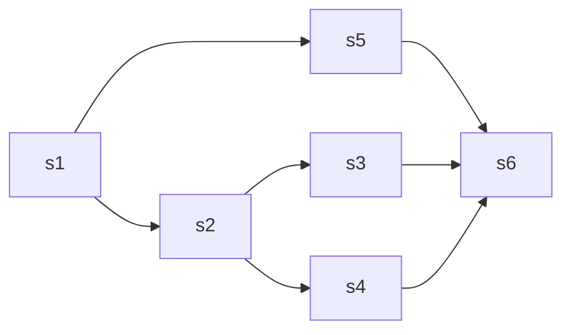

# parallel-schedule

**轻量级并行调度框架**

## 目标

- 动作由用户自定义(不限于 RPC)
- 最大限度并行执行
- 依赖死循环自检
- 输入依赖关系后自动进行调度，无需控制先后
- 可控中断，某一步失败，可以中断/不中断执行
  - 处理 goroutine 中的 panic

## 怎么使用

只要把依赖关系定义好，就能够自动分析依赖，最大限度并行执行。

例如有以下依赖关系：



依赖关系输入：

```go
myDataBus := &MyDataBus{}
s1 := &MyStep1{Input: myDataBus}
s2 := &MyStep2{Input: myDataBus}
s3 := &MyStep3{Input: myDataBus}
s4 := &MyStep4{Input: myDataBus}
s5 := &MyStep5{Input: myDataBus}
s6 := &MyStep6{Input: myDataBus}
scheduler := parallel.InitScheduler().
AddDependency(s1, s2).
AddDependency(s1, s5).
AddDependency(s2, s3).
AddDependency(s2, s4).
AddDependency(s5, s6).
AddDependency(s3, s6).
AddDependency(s4, s6)
```

其中 dataBus 作为数据总线，dataBus 由使用方自定义，数据的传递依托于 dataBus

## 设计与实现

### 如何自动调度

调度器首先会分析依赖关系，确认是有向无环图(DAG).

然后遍历入度为 0 的节点，开始并行执行，执行完的节点放进**完成队列**中，同时消费**完成队列**中的节点，遍历其邻接节点，如果邻接节点没有其他依赖，就会异步执行。直到所有节点执行完毕或者出现中断。
中断通过返回 error 实现。

执行过程是动态的拓扑排序，每个节点的执行时长都会影响顺序。  
并**不是**BFS，BFS 每层之间会出现阻塞，影响并发度。

### 死循环自检

会 DFS 检测依赖中是否有死循环。

### 完成队列

完成队列是实现的关键，完成队列是一个阻塞队列，执行完的节点都会先 add 进队列中，同时消费队列去触发执行邻接节点。  
队列要保证线程安全，用 channels。

> chan 在这里很适用

### error chan

在消费完成队列的同时也消费 error，一旦有 error 就中断执行并返回。
