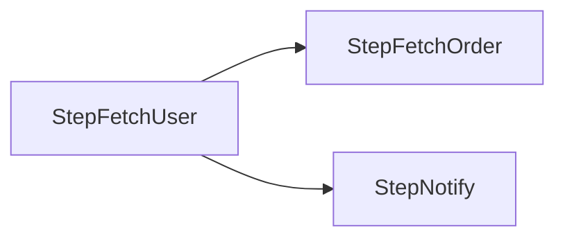

# parallel-schedule

[](https://go.dev/)
[](LICENSE)

[中文](README_CN.md)

A lightweight Go parallel task scheduling framework based on DAG (Directed Acyclic Graph) that automatically analyzes dependencies and maximizes parallel execution.

## Features

- **Auto Scheduling** — Just define dependencies, the framework automatically performs topological sorting and maximizes parallel execution
- **Dynamic Topological Sort** — Not BFS layer-by-layer execution, avoids inter-layer blocking and improves concurrency
- **Cycle Detection** — DFS cycle detection before launch, fail fast
- **Error Interruption** — When any step fails, no new subsequent steps are triggered, error is returned
- **Panic Recovery** — Panics inside goroutines are captured and converted to errors
- **Dependency Graph Generation** — Generate Mermaid flowcharts to visualize dependencies

## Installation

```bash
go get github.com/duskbat/parallel-schedule
```

## Quick Start

### 1. Define Data Bus

The data bus is used to pass data between steps, defined by the user:

```go
type MyDataBus struct {
    UserID   int
    UserName string
    Result   string
}
```

### 2. Implement Step Interface

Each step implements the `Step` interface. **Note that each step must be a distinct type** (the type name is used as the scheduling key):

```go
type StepFetchUser struct {
    Data *MyDataBus
}

func (s *StepFetchUser) Process(ctx context.Context) error {
    s.Data.UserName = "Alice"
    return nil
}

type StepFetchOrder struct {
    Data *MyDataBus
}

func (s *StepFetchOrder) Process(ctx context.Context) error {
    s.Data.Result = fmt.Sprintf("order of %s", s.Data.UserName)
    return nil
}
```

### 3. Define Dependencies and Launch

```go
bus := &MyDataBus{UserID: 1}

s1 := &StepFetchUser{Data: bus}
s2 := &StepFetchOrder{Data: bus}
s3 := &StepNotify{Data: bus}

err := parallel.InitScheduler().
    AddDependency(s1, s2).  // s2 runs after s1
    AddDependency(s1, s3).  // s3 runs after s1 (s2 and s3 run in parallel)
    Launch(context.Background())

if err != nil {
    log.Fatal(err)
}
```

Execution flow for the above dependencies:


```mermaid
flowchart LR
    StepFetchUser --> StepFetchOrder
    StepFetchUser --> StepNotify
```

### 4. Generate Dependency Graph (Optional)

Generate Mermaid flowchart files during development:

```go
scheduler := parallel.InitScheduler().
    AddDependency(s1, s2).
    AddDependency(s1, s3)

scheduler.GenerateGraphLR("graph.md") // left to right
scheduler.GenerateGraphTB("graph.md") // top to bottom
```

> Remove the `GenerateGraph` call after generation, as it calls `os.Exit(1)`.

## Design

### Scheduling Flow

1. Build adjacency list and in-degree table
2. DFS cycle detection
3. Launch all nodes with in-degree 0 (nodes without dependencies run in parallel)
4. Completed nodes are put into a finish queue (channel), consuming the queue triggers subsequent nodes
5. Adjacent nodes are executed asynchronously as soon as their in-degree reaches 0
6. Ends when all nodes complete or an error occurs

### Why Not BFS

BFS executes layer by layer with synchronization blocking between layers. This framework uses dynamic topological sorting — completed nodes immediately trigger successors, and each node's actual execution time dynamically affects scheduling order, maximizing parallelism.

## Project Structure

```
parallel/
├── schedule.go        # Scheduler core
├── step.go            # Step interface
├── error.go           # PanicError type
├── generate_graph.go  # Mermaid graph generation
└── schedule_test.go   # Tests
```

## License

[MIT](LICENSE) - Copyright (c) 2025 Weiye Mu
