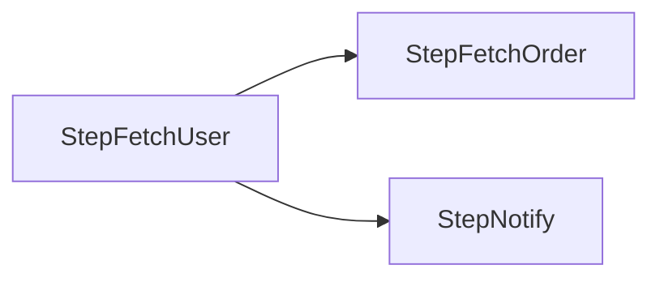

# parallel-schedule

[](https://go.dev/)
[](LICENSE)

[English](README.md)

轻量级 Go 并行任务调度框架，基于 DAG（有向无环图）自动分析依赖关系，最大限度并行执行任务。

## 特性

- **自动调度** — 只需定义依赖关系，框架自动进行拓扑排序并最大化并行执行
- **动态拓扑排序** — 非 BFS 分层执行，避免层间阻塞，提升并发度
- **环检测** — 启动前 DFS 检测循环依赖，快速失败
- **错误中断** — 任一步骤失败后不再触发新的后续步骤，返回错误
- **Panic 恢复** — goroutine 内 panic 被捕获并转为 error 返回
- **依赖图生成** — 一键生成 Mermaid 流程图，可视化依赖关系

## 安装

```bash
go get github.com/duskbat/parallel-schedule
```

## 快速开始

### 1. 定义数据总线

数据总线用于在各步骤之间传递数据，由使用方自定义：

```go
type MyDataBus struct {
    UserID   int
    UserName string
    Result   string
}
```

### 2. 实现 Step 接口

每个步骤实现 `Step` 接口，**注意每个步骤必须是不同的类型**（类型名作为调度 key）：

```go
type StepFetchUser struct {
    Data *MyDataBus
}

func (s *StepFetchUser) Process(ctx context.Context) error {
    // 执行具体逻辑，如 RPC 调用、数据库查询等
    s.Data.UserName = "Alice"
    return nil
}

type StepFetchOrder struct {
    Data *MyDataBus
}

func (s *StepFetchOrder) Process(ctx context.Context) error {
    s.Data.Result = fmt.Sprintf("order of %s", s.Data.UserName)
    return nil
}
```

### 3. 定义依赖并启动

```go
bus := &MyDataBus{UserID: 1}

s1 := &StepFetchUser{Data: bus}
s2 := &StepFetchOrder{Data: bus}
s3 := &StepNotify{Data: bus}

err := parallel.InitScheduler().
    AddDependency(s1, s2).  // s1 完成后执行 s2
    AddDependency(s1, s3).  // s1 完成后执行 s3（s2、s3 并行）
    Launch(context.Background())

if err != nil {
    log.Fatal(err)
}
```

上述依赖关系对应的执行流程：



### 4. 生成依赖图（可选）

开发调试时可生成 Mermaid 流程图文件：

```go
scheduler := parallel.InitScheduler().
    AddDependency(s1, s2).
    AddDependency(s1, s3)

scheduler.GenerateGraphLR("graph.md") // 从左到右
scheduler.GenerateGraphTB("graph.md") // 从上到下
```

> 生成完成后请删除 `GenerateGraph` 调用，该方法会调用 `os.Exit(1)`。

## 设计原理

### 调度流程

1. 构建邻接表和入度表
2. DFS 检测循环依赖
3. 启动所有入度为 0 的节点（无依赖的节点并行执行）
4. 节点完成后放入完成队列（channel），消费队列触发后续节点
5. 邻接节点入度减为 0 时立即异步执行
6. 所有节点完成或出现 error 时结束

### 为什么不用 BFS

BFS 按层执行，每层之间存在同步阻塞。本框架采用动态拓扑排序，节点完成即触发后续，每个节点的实际执行时长动态影响调度顺序，最大化并行度。

## 项目结构

```
parallel/
├── schedule.go        # 调度器核心实现
├── step.go            # Step 接口定义
├── error.go           # PanicError 类型
├── generate_graph.go  # Mermaid 依赖图生成
└── schedule_test.go   # 测试用例
```

## License

[MIT](LICENSE) - Copyright (c) 2025 Weiye Mu
